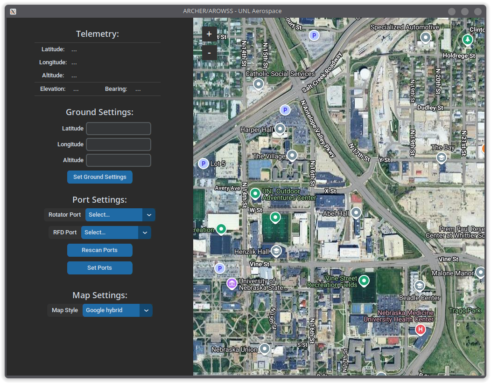

# ARCHER/AROWSS GUI
This application is an interface to the ARCHER ground station and rotator part
of the UNL Aerospace Rocketry IREC Payload for 2025.

## Development
To run this application, please install `uv`, instructions for doing so can be
found at the following link:

Once you have done that, you should be able to run the `uv` command, so you can
run the application with `uv run src/main.py`.

Additionally, the CI pipeline for this application runs checks against `ruff`
to ensure the code is clean. To ensure your code will pass CI, run `ruff check`
using `uvx ruff check`.
